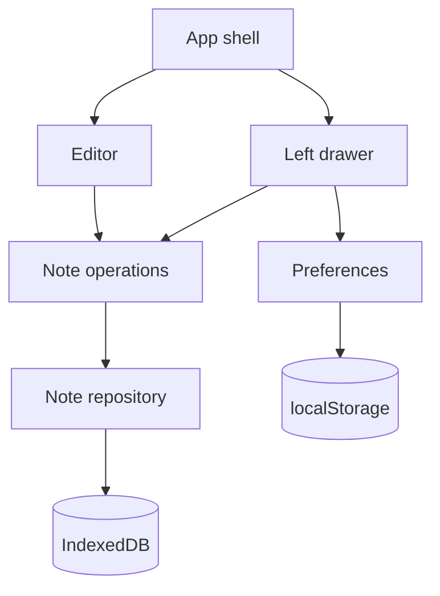

# Technical Design

## 1. Goals

Projekt opisuje statyczną, desktopową aplikację SPA do tworzenia i edytowania lokalnych notatek tekstowych. Interfejs jest zorganizowany wokół jednego, pełnoekranowego edytora. Lista notatek i ustawienia wyglądu są dostępne w wysuwanym panelu po lewej stronie.

Aplikacja musi:

- działać bez backendu, kont użytkowników i synchronizacji;
- przechowywać notatki wyłącznie w IndexedDB bieżącego profilu przeglądarki;
- przechowywać ustawienia wyglądu w `localStorage`;
- identyfikować notatkę wewnętrznie przez UUID, a w adresie przez unikalny slug;
- obsługiwać trasy `/` i `/notatki/:slug`, również po bezpośrednim wejściu na GitHub Pages;
- automatycznie zapisywać treść po 400 ms bezczynności;
- wyświetlać ostatnio edytowane notatki w panelu bocznym bez dat i statystyk;
- umożliwiać zmianę kolorów, fontu, rozmiaru, interlinii i szerokości edytora;
- działać offline po wcześniejszym załadowaniu zasobów;
- traktować zawartość jako zwykły tekst;
- nie implementować importu ani eksportu JSON;
- zapewniać główne przepływy z klawiatury i zgodność co najmniej z WCAG 2.1 AA.

## 2. Assumptions

- Repozytorium zawiera jedną aplikację frontendową, a wynik kompilacji jest publikowany jako statyczny katalog.
- Docelowy prefiks GitHub Pages jest podawany podczas budowania przez konfigurację Vite. Trasy logiczne nie zawierają tego prefiksu.
- `/` otwiera rekord o najwyższym `updatedAt`. Jeżeli baza jest pusta, pokazuje pusty, jeszcze niezapisany edytor.
- Kliknięcie „Nowa notatka” czyści roboczy stan edytora, ale nie tworzy rekordu. Rekord powstaje przy pierwszej zmianie tytułu lub treści.
- Nowa notatka bez nazwy otrzymuje tytuł „Bez tytułu” i pierwszy wolny slug z serii `bez-tytulu`, `bez-tytulu-2`, ... dopiero podczas pierwszego zapisu.
- Wejście na nieistniejący `/notatki/:slug` pokazuje pusty edytor. Rekord powstaje przy pierwszej zmianie; początkowy tytuł jest czytelną wersją sluga.
- Zmiana tytułu generuje nowy slug. Przy konflikcie używany jest pierwszy wolny wariant liczbowy, a użytkownik otrzymuje dyskretną informację.
- `updatedAt` jest technicznym polem do sortowania. Nie jest wyświetlane i nie służy do statystyk.
- Panel boczny jest domyślnie zamknięty. Jego stan nie musi być zachowywany między uruchomieniami.
- Ustawienia wyglądu obowiązują globalnie dla wszystkich notatek i są stosowane natychmiast.
- Wartości kolorów są zapisywane jako znormalizowane sześciocyfrowe wartości hex.
- Font wybierany jest z krótkiej listy bezpiecznych fontów systemowych. Implementacja nie pobiera fontów z zewnętrznego CDN.
- Domyślne wartości wyglądu są zgodne z referencją: tło `#233d4d`, tekst `#fe7f2d`, Courier New, 13pt, interlinia 1.8, szerokość 920 px.
- Opcjonalny eksport `.txt` dotyczy wyłącznie bieżącej notatki. Brak importu, eksportu zbiorczego i modułu kopii zapasowych.
- Nie jest wymagane odzyskiwanie notatek po wyczyszczeniu danych strony.

## 3. Technology Stack

| Obszar | Wybór | Uzasadnienie |
| --- | --- | --- |
| Framework / runtime | Preact 10, TypeScript | Mały rozmiar aplikacji i prosty model komponentów. |
| Narzędzie budowania | Vite | Statyczny build, TypeScript i konfigurowalny `base` dla GitHub Pages. |
| Dane notatek | `idb` nad IndexedDB | Asynchroniczny zapis, transakcje i indeksy bez rozbudowanej warstwy danych. |
| Preferencje UI | Natywny `localStorage` | Mały, niewrażliwy i synchronicznie odczytywany zestaw ustawień. |
| Routing | Mały moduł nad History API | Aplikacja ma tylko dwa wzorce tras. |
| Offline | `vite-plugin-pwa` / Workbox w trybie precache | Ponowne uruchomienie bez sieci po pierwszym załadowaniu. |
| UI | Semantyczny HTML i lokalny CSS | Brak potrzeby frameworka komponentów wizualnych. |
| Testy | Vitest, Testing Library, `fake-indexeddb` | Testy komponentów i magazynu bez prawdziwej przeglądarki. |
| Hosting | GitHub Pages | Spełnia wymaganie statycznego hostingu. |

Build produkcyjny tworzy `dist/` z `index.html`, zasobami z fingerprintami, service workerem i `404.html`. Aplikacja nie korzysta w czasie działania z CDN, API ani zewnętrznych skryptów.

## 4. Architecture



Główne elementy:

- **App shell** — rozpoznaje trasę, ładuje notatkę startową, kontroluje panel boczny i obsługuje błędy globalne.
- **Editor** — przechowuje roboczy tytuł i treść, uruchamia auto-save i nie renderuje metadanych.
- **Left drawer** — tworzenie notatki, filtrowanie i wybór tytułu, ustawienia wyglądu oraz działania dla bieżącej notatki.
- **Note operations** — generowanie slugów, tworzenie UUID, zmiana nazwy i koordynacja zapisu.
- **Note repository** — jedyne miejsce wykonujące operacje na IndexedDB.
- **Preferences** — walidacja, odczyt i zapis ustawień oraz wystawienie ich jako CSS custom properties.
- **Routing** — obsługa `base`, History API i `popstate`.
- **Service worker** — precache zasobów aplikacji; nie ma dostępu do treści notatek.

Nie jest potrzebny globalny framework stanu. Stan bieżącej notatki i panelu pozostaje w `App`; trwałym źródłem prawdy są IndexedDB i `localStorage`.

## 5. Project Structure

```text
/
├── public/
│   └── 404.html
├── src/
│   ├── components/
│   │   ├── Editor.tsx
│   │   ├── LeftDrawer.tsx
│   │   ├── NotesList.tsx
│   │   ├── AppearanceSettings.tsx
│   │   ├── DeleteNoteDialog.tsx
│   │   └── ErrorToast.tsx
│   ├── app.tsx
│   ├── main.tsx
│   ├── noteOperations.ts
│   ├── noteRepository.ts
│   ├── preferences.ts
│   ├── routing.ts
│   ├── slug.ts
│   ├── types.ts
│   └── styles.css
├── tests/
│   ├── unit/
│   └── integration/
├── index.html
├── vite.config.ts
├── tsconfig.json
└── package.json
```

Nie ma osobnych widoków listy i ustawień ani modułu `backup.ts`.

## 6. Data Model

### Note

```ts
interface Note {
  id: string;
  title: string;
  slug: string;
  content: string;
  updatedAt: number;
}
```

- `id` jest UUID i kluczem głównym.
- `slug` jest unikalnym indeksem używanym przez routing.
- `updatedAt` jest znacznikiem czasu Unix w milisekundach używanym wyłącznie do sortowania.
- Model nie zawiera statystyk, liczby słów, historii zmian ani daty utworzenia.

### Editor preferences

```ts
interface EditorPreferences {
  backgroundColor: string;
  textColor: string;
  fontFamily: "Courier New" | "Consolas" | "Georgia" | "Arial";
  fontSizePt: number;
  lineHeight: number;
  editorWidthPx: number;
}
```

Dozwolone zakresy:

| Pole | Zakres |
| --- | --- |
| `fontSizePt` | 10–24 pt |
| `lineHeight` | 1.2–2.4 |
| `editorWidthPx` | 480–1200 px |

Nieprawidłowe dane z `localStorage` są odrzucane pole po polu i zastępowane wartością domyślną.

### Save state

```ts
type SaveState = "unchanged" | "dirty" | "saving" | "saved" | "error";
```

Stan jest wewnętrzny. Tylko `error` wymaga widocznego komunikatu. `dirty` służy do ostrzeżenia przed opuszczeniem strony.

## 7. Storage

### IndexedDB

- Baza: `local-notes`.
- Wersja schematu: `1`.
- Object store: `notes`.
- Klucz główny: `id`.
- Unikalny indeks: `slug`.
- Indeks do sortowania: `updatedAt`.

Repozytorium udostępnia minimalny kontrakt:

```ts
interface NoteRepository {
  getBySlug(slug: string): Promise<Note | undefined>;
  getMostRecent(): Promise<Note | undefined>;
  listMostRecent(): Promise<Note[]>;
  save(note: Note): Promise<void>;
  delete(id: string): Promise<void>;
  isSlugAvailable(slug: string, exceptId?: string): Promise<boolean>;
}
```

`listMostRecent` korzysta z indeksu `updatedAt` w kierunku malejącym. UI renderuje tylko `title` i `slug`.

### localStorage

| Klucz | Zawartość |
| --- | --- |
| `local-notes:preferences:v1` | Ustawienia wyglądu |
| `local-notes:data-notice-dismissed:v1` | Flaga zamknięcia komunikatu |

Zapis preferencji jest wykonywany po każdej poprawnej zmianie. CSS jest aktualizowany przed zapisem, dzięki czemu kontrolki działają natychmiast.

### Błędy

- Błąd odczytu notatki pokazuje komunikat i nie nadpisuje rekordu.
- Błąd zapisu pozostawia najnowszą treść w pamięci widoku, ustawia stan `error` i umożliwia ponowienie po kolejnej zmianie.
- Błąd preferencji przywraca wyłącznie uszkodzone pole do wartości domyślnej.
- Aplikacja nie próbuje pobierać ani odzyskiwać danych z sieci.

## 8. Routing

| Trasa | Zachowanie |
| --- | --- |
| `/` | Pobranie najnowszej notatki lub nowy pusty edytor |
| `/notatki/:slug` | Pobranie wskazanej notatki lub roboczy pusty edytor |
| Inna | Komunikat błędu z działaniem „Otwórz edytor” |

Moduł routingu oddziela `base path`, np. `/local-notes-editor/`, od logicznej ścieżki. Nawigacja pomiędzy notatkami korzysta z `history.pushState`. Zmiana sluga bieżącej notatki korzysta z `history.replaceState`.

### GitHub Pages direct link

`404.html` przekazuje żądaną ścieżkę do bazowego `index.html`. Kod startowy natychmiast odtwarza trasę przez `history.replaceState` przed renderowaniem. Mechanizm przekazuje wyłącznie ścieżkę zawierającą slug; treść i tytuł nie trafiają do URL.

## 9. UI Design

### Editor surface

Główny obszar zajmuje cały viewport i używa następujących custom properties:

```css
:root {
  --editor-bg: #233d4d;
  --editor-text: #fe7f2d;
  --editor-font-family: "Courier New", monospace;
  --editor-font-size: 13pt;
  --editor-line-height: 1.8;
  --editor-width: 920px;
}
```

Edytor zawiera tylko:

- dyskretny przycisk otwarcia panelu w lewym górnym rogu;
- pole tytułu;
- pole treści;
- toast renderowany wyłącznie dla błędu lub działania wymagającego potwierdzenia.

Nie renderuje paska aplikacji, sluga, dat, statusu udanego zapisu, licznika słów ani stopki. Pola mają przezroczyste tło i brak ramek. Kolumna jest wyśrodkowana i ma `width: min(var(--editor-width), calc(100vw - 96px))`.

### Left drawer

Panel ma szerokość 400 px, jasne tło i własne przewijanie. Jest renderowany nad edytorem, dzięki czemu otwarcie nie zmienia szerokości ani położenia tekstu.

Kolejność zawartości:

1. zamknięcie panelu i „Nowa notatka”;
2. wyszukiwarka;
3. lista tytułów ostatnio edytowanych notatek;
4. karta „Appearance”;
5. karta „Typography”;
6. eksport `.txt` i usunięcie bieżącej notatki;
7. jednorazowa informacja o lokalnym przechowywaniu.

Panel używa tokenów niezależnych od kolorów edytora, aby pozostał czytelny przy dowolnej konfiguracji:

```css
:root {
  --panel-bg: #ffffff;
  --panel-surface: #fafafa;
  --panel-text: #2f3550;
  --panel-muted: #959bb1;
  --panel-border: #e5e5e8;
}
```

Karty ustawień mają promień 14 px, obramowanie 1 px i wiersze oddzielone linią. Etykieta jest po lewej, kontrolka po prawej. Kontrolki koloru obejmują natywny `input[type=color]` i edytowalne pole hex.

### Drawer behavior and accessibility

- Przycisk ma `aria-controls="left-drawer"` i aktualne `aria-expanded`.
- Panel jest dialogiem niemodalnym wizualnie, ale po otwarciu utrzymuje fokus w swoim obrębie.
- `Escape` zamyka panel i zwraca fokus do przycisku otwarcia.
- Kliknięcie w półprzezroczystą warstwę nad edytorem zamyka panel.
- Animacja używa wyłącznie `transform` i trwa maksymalnie 180 ms.
- Przy `prefers-reduced-motion: reduce` panel zmienia stan bez animacji.

## 10. Main Flows

### Start application

1. Odczytaj i zwaliduj preferencje.
2. Zastosuj CSS custom properties przed pierwszym renderem edytora.
3. Rozpoznaj trasę.
4. Dla `/` pobierz ostatnio edytowaną notatkę; dla sluga pobierz wskazany rekord.
5. Ustaw fokus w treści albo tytule pustego edytora.

### Auto-save

1. Zmiana tytułu lub treści ustawia `dirty` i restartuje timer 400 ms.
2. Dla nowej notatki operacja tworzy UUID, bezpieczny tytuł i wolny slug.
3. Dla istniejącej notatki zachowuje UUID i aktualizuje `updatedAt`.
4. Repozytorium zapisuje rekord w pojedynczej transakcji `readwrite`.
5. Po sukcesie aplikacja ustawia `saved`, aktualizuje trasę w razie potrzeby i odświeża kolejność panelu bez pokazywania statusu.
6. Po błędzie ustawia `error` i pokazuje komunikat.
7. Jeśli podczas transakcji pojawiły się kolejne zmiany, wykonywany jest następny zapis najnowszej wersji.

### Open note from drawer

1. Pobierz listę z indeksu `updatedAt` malejąco.
2. Filtruj po tytule bez uwzględniania wielkości liter.
3. Po wyborze zabezpiecz lub dokończ oczekujący zapis bieżącej notatki.
4. Przejdź do `/notatki/{slug}`.
5. Załaduj notatkę, zamknij panel i ustaw fokus w treści.

### Change appearance

1. Kontrolka waliduje wartość względem dozwolonego formatu i zakresu.
2. Poprawna wartość aktualizuje odpowiednią custom property.
3. Pełny obiekt preferencji jest zapisywany w `localStorage`.
4. Dla kolorów obliczany jest kontrast; wynik poniżej 4.5:1 pokazuje ostrzeżenie w karcie.

### Delete note

1. Działanie z panelu otwiera dialog z tytułem notatki.
2. Po potwierdzeniu repozytorium usuwa rekord według UUID.
3. Aplikacja ładuje następną najnowszą notatkę lub pusty edytor.
4. Trasa jest aktualizowana bez pozostawienia usuniętego sluga jako aktywnego widoku.

### Export current note as TXT

1. Utwórz `Blob` typu `text/plain;charset=utf-8` wyłącznie z treści bieżącej notatki.
2. Nazwa pliku pochodzi z bezpiecznego sluga.
3. Uruchom pobranie i natychmiast zwolnij tymczasowy object URL.

## 11. Offline, Privacy and Security

- Service worker precache'uje wyłącznie skompilowane zasoby.
- Treść notatek nie przechodzi przez service worker i nie jest zapisywana w Cache Storage.
- Brak fetchy do API, analityki i zewnętrznych fontów.
- Tytuł i treść są wiązane jako wartości pól formularza, nigdy jako `innerHTML`.
- Pola kolorów akceptują wyłącznie poprawny format hex.
- CSP może działać bez `unsafe-inline` po przeniesieniu skryptu i CSS makiety do plików źródłowych podczas implementacji.

Rezygnacja z JSON oznacza brak mechanizmu kopii zapasowej. Informacja o lokalnym charakterze danych nie może sugerować możliwości odtworzenia notatek.

## 12. Testing Strategy

### Unit tests

- normalizacja tytułu i konflikty slugów;
- walidacja oraz wartości domyślne preferencji;
- obliczenie kontrastu kolorów;
- wybór ostatnio edytowanej notatki;
- filtrowanie listy po tytule;
- mapowanie trasy z uwzględnieniem `base`.

### Integration tests

- pierwszy wpis tworzy notatkę i aktualizuje trasę;
- auto-save zachowuje najnowszą wersję przy zmianach podczas transakcji;
- `/` ładuje rekord o najwyższym `updatedAt`;
- panel otwiera się, zamyka i poprawnie zarządza fokusem;
- wybór notatki zamyka panel i zmienia trasę;
- zmiana ustawienia natychmiast aktualizuje CSS i `localStorage`;
- usunięcie otwiera następną notatkę;
- błąd IndexedDB pozostawia dane w pamięci i pokazuje błąd;
- w UI nie występują daty, statystyki ani akcje JSON.

### Manual checks

- bezpośrednie wejście na trasę GitHub Pages;
- ponowne uruchomienie offline;
- obsługa klawiaturą w Chrome, Edge i Firefox;
- czytelność domyślnej palety i ostrzeżenie dla niskiego kontrastu;
- układ przy 1024 × 768 oraz na szerokim ekranie.

## 13. Technical Decisions

| Decyzja | Wybór | Powód |
| --- | --- | --- |
| Główny widok | Zawsze edytor | Eliminuje krok pośredni i utrzymuje koncentrację na tekście. |
| Lista i ustawienia | Jeden wysuwany panel | Rzadziej używane elementy pozostają dostępne bez osobnych stron. |
| Sortowanie | Wewnętrzne `updatedAt` | Pozwala pokazać ostatnie notatki bez eksponowania dat. |
| Trwały magazyn | IndexedDB przez `idb` | Asynchroniczne API, indeksy i transakcje. |
| Preferencje | `localStorage` + CSS custom properties | Natychmiastowy start i prosta aktualizacja wyglądu. |
| Routing | Dwie trasy nad History API | Osobna biblioteka routingu nie daje korzyści przy tym zakresie. |
| Auto-save | Debounce 400 ms | Spełnia wymaganie szybkiego zapisu bez przycisku. |
| Status zapisu | Widoczny tylko błąd | Czysty edytor bez stałych metadanych. |
| Kopia zapasowa | Brak JSON | Świadome uproszczenie zakresu zgodne z PRD 1.1. |
| Kierunek wizualny | Konfigurowalny edytor, domyślnie navy/orange Courier New | Odwzorowuje załączoną referencję. |

## 14. Open Questions

None.

## Consistency Check

- Dokument nie zawiera osobnej strony listy ani ustawień.
- Lista notatek istnieje wyłącznie w wysuwanym panelu i nie pokazuje dat.
- `updatedAt` jest wyłącznie technicznym kluczem sortowania.
- Nie istnieje model kopii, import, eksport JSON ani rozwiązywanie konfliktów importu.
- Edytor nie pokazuje statystyk, metadanych i stałego statusu udanego zapisu.
- Ustawienia i domyślna paleta odpowiadają wartościom widocznym w referencji.
- Projekt pozostaje zgodny ze statycznym hostingiem GitHub Pages i nie wymaga backendu.
